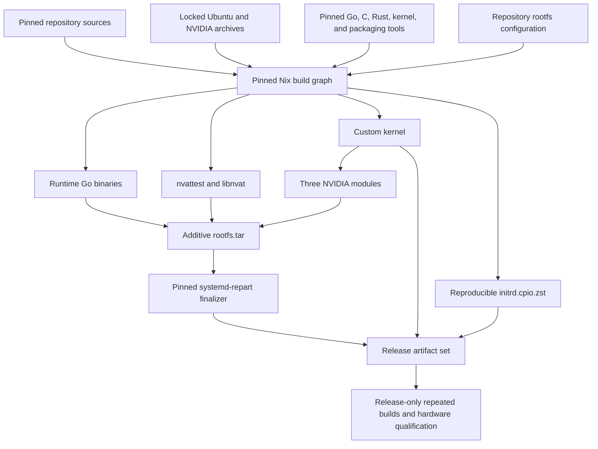

# Image build

Confidential virtual machine (CVM) means reduced trusted computing base (TCB).

Normally, when building a hardened image, the simplest approach is to start from something that works and remove all the crap. That is a subtractive approach. It is especially functional when making sure complex applications (like AI inference or training that leverage GPUs and complex drivers) can run at full speed.
The issue with a subtractive approach is that it makes the final image harder to audit. You basically need to trust us not to have forgotten to remove anything, and, when packages evolve or change after an update, that nothing fishy made it in.

We decided to try a different additive approach: we start from an empty image and declare everything that makes it in. That makes it trivial to audit our image and easier to later shrink the TCB even more.

The image is not assembled by scripts; it is declared. The repository
describes every input and every byte of the final image, and a single tool,
pure Nix, hermetically realizes that description. Nothing enters the image
implicitly: every outside input is pinned by hash, and the whole definition
is small enough (1,400 lines) to actually read.

Because the build is deterministic, the result is byte-for-byte reproducible:
anyone can rebuild the image from source, on their own machine, and obtain
exactly the artifacts we ship. That closes the loop that makes a confidential
VM trustworthy: the measurement a running enclave attests to traces all the
way back to public source code, not to our word or our build machines.

## Graph



This is intentionally kept simple: everything is built end-to-end in isolation, on a single builder.

## Nix ownership

The top-level `default.nix` pins one Nixpkgs source and exposes the complete set
of image inputs:


| Output                             | Owner                                                  | Declaration                                                                                          |
| ---------------------------------- | ------------------------------------------------------ | ---------------------------------------------------------------------------------------------------- |
| Runtime and debug Go binaries      | Nixpkgs `buildGoModule`                                | `nix/go.nix`, `tinfoil/go.mod`, `tinfoil/go.sum`                                                     |
| Fixed initrd                       | Pinned GNU cpio and Zstandard                          | `nix/initrd.nix`                                                                                     |
| Custom kernel                      | Nixpkgs `linuxManualConfig`                            | `nix/kernel.nix`, `kernel/tinfoil-cvm-7.0.defconfig`, `kernel/config.d/10-tinfoil-cvm-policy.config` |
| Three NVIDIA modules               | Nixpkgs kernel-module build                            | `nix/nvidia-modules.nix`                                                                             |
| nvattest and libnvat               | Nixpkgs CMake and Rust builders                        | `nix/nvattest.nix`, `nix/locks/regorus.Cargo.lock`                                                   |
| Ubuntu package payloads            | Nixpkgs `debClosureGenerator` and fixed-output fetches | `nix/runtime-packages.nix`, `nix/runtime-packages-lock.nix`                                          |
| NVIDIA, Docker, and debug payloads | Fixed-output archive fetches                           | `nix/runtime-sources.nix`                                                                            |
| Repository configuration           | Direct additive copy                                   | `image/rootfs/`                                                                                      |
| Rootfs and debug layer archives    | Fixed tar materializer                                 | `nix/rootfs.nix`                                                                                     |
| Shipping and debug disk images     | Nix-owned fakeroot and `systemd-repart`                | `nix/image.nix`, `repart.d/`                                                                         |


Go binaries and Go validation use the same Nixpkgs Go 1.26 toolchain. The
three NixOS-only patches that prepend Nix-store paths for timezone, MIME, and
IANA databases are omitted so measured guest binaries retain upstream Linux
lookup paths and contain no Nix-store references. All other Nixpkgs Go patches
and the upstream `buildGoModule` machinery remain unchanged.

All builders — CI, release, operators, and auditors — install Nix through one
script, `nix/install.sh`, which lives beside the pin files it enforces. It
installs the official Nix 2.35.1 binary
release pinned by `nix/nix-version`, `nix/nix-x86_64-linux.sha256`, and the
expected Nix store path, and refuses a pre-existing, unverified Nix
installation. Every builder therefore uses the same official release
for both the client and daemon, with `sandbox = true`,
`sandbox-fallback = false`, `restrict-eval = true`, and
`allowed-uris = https://github.com/NixOS/nixpkgs/archive/`. A sandbox setup
failure therefore stops the build rather than changing its isolation boundary,
and the only network input permitted at evaluation time is the hash-pinned
Nixpkgs archive, so an unpinned evaluation-time fetch fails closed. The remaining host prerequisites
are an x86_64 Linux host with systemd, `sudo`, `curl`, `tar`, `xz`, and the
kernel features required by the Nix sandbox. GitHub runner images may float.
Artifact construction runs inside the Nix sandbox.

The pinned Nixpkgs source is imported with an empty configuration and no
overlays. Developer or machine-local Nixpkgs configuration is not part of the
build graph.

`nix/rootfs.nix` is additive: it starts from an empty tree and installs only
the declared package paths, Nix-built outputs, and repository files. Package
archives are extracted into build-only staging trees; package maintainer
scripts do not run, and manuals, headers, service units, package helpers, and
other undeclared paths never enter the image. The Ubuntu package closure is
still the pinned source of runtime libraries and the CA bundle, but the
measured rootfs contains only its declared runtime payload. NVIDIA graphics,
video, OpenCL, host diagnostics, CUDA debugger and MPS tools, distro boot
integration, systemd units, Turing-only firmware, and legacy NVIDIA
runtime-hook compatibility are likewise excluded. The CUDA compute, CDI
container, attestation, firmware, and NVSwitch payloads remain.

The Nix expressions also reject store references in runtime binaries and use
fixed ownership, modes, archive ordering, and timestamps. Reproducibility is a
property demonstrated by repeated clean builds and cross-host comparison; it
is not inferred merely from using Nix.

## Image finalization

`nix/image.nix` extracts the rootfs and optional debug layer within one
fakeroot session, then invokes the pinned Nixpkgs `systemd-repart` directly.
It receives only:

- `rootfs.tar`;
- the debug rootfs layer for `debug-image`; and
- the fixed partition definitions and seed in `repart.d/`;
- the Nix-built kernel and initrd.

It performs no package installation or network access. The derivation creates
the root filesystem, partition table, dm-verity metadata, and one validated
artifact directory. Missing, duplicate, or malformed root-hash output fails
the build.

The disk contains only a fixed 2 GiB ext4 root partition and the exact
dm-verity hash partition calculated by `systemd-repart`. QEMU supplies the
kernel, initrd, and firmware directly, so the image has no empty ESP. The build
fails if the additive rootfs does not fit the fixed root partition.

## Build interface

The supported interface is the named Nix outputs:

```sh
nix-build -I . -A rootfs-archive -o result-rootfs
nix-build -I . -A shipping-image -o result
nix-build -I . -A debug-image -o result-debug
nix-build -I . -A checks
```

Focused producer outputs such as `runtime-go`, `kernel-artifacts`,
`nvidia-modules`, `nvattest`, and `initrd` remain directly buildable. There is
no task-runner layer and deleting result symlinks or collecting the Nix store
is a separate host operation.

Regenerate the reviewed Ubuntu package lock only when changing package inputs
or snapshot indexes:

```sh
nix-build --option sandbox true -I . -A runtime-package-lock -o result-package-lock
cp --no-preserve=mode result-package-lock nix/runtime-packages-lock.nix
rm result-package-lock
```


## Auditing the build

An audit answers three questions: what goes in, what comes out, and whether an
independent rebuild matches the published release. Each has a mechanical
check.

### 1. Reproduce the artifacts

On any x86_64 Linux host, check out the release commit and run
`nix/install.sh`. It downloads the pinned official Nix release,
verifies its checksum, installs it with the required sandbox and
restricted-evaluation settings, and asserts the result — CI and release
builders run the same script, so there is exactly one installation path.
The installer does not modify shell profiles, so put it on `PATH` and build:

```sh
export PATH="/nix/var/nix/profiles/default/bin:$PATH"
nix-build -I . -A shipping-image -o result
```

Compare `sha256sum result/*` and the dm-verity root hash in
`result/tinfoilcvm.roothash` against the published release checksums and
manifest. Matching hashes mean the published artifacts are exactly what this
source tree produces; the root hash is also the value bound into runtime
attestation.

### 2. Enumerate every external input

Every external input of a target is a fixed-output derivation in its closure:
a fetch that declares its expected hash before the sandbox permits network
access. Enumerate them all, with their hashes, from the instantiated
derivation graph:

```sh
drv="$(nix-instantiate -I . -A shipping-image)"
nix --extra-experimental-features nix-command derivation show -r "$drv" \
  | jq -r '.derivations | to_entries[]
      | select(.value.outputs.out.hash?)
      | [(.value.env.urls // .value.env.url // .value.name),
         .value.outputs.out.hash] | @tsv' \
  | sort -u
```

An empty hash column cannot occur: a derivation without a declared output
hash builds with no network access at all. Together with the hash-pinned
Nixpkgs source in `nixpkgs.lock.json`, this list is the complete set of bytes
that enter the build from outside the repository.

### 3. Review the declarations

The ownership table above maps every output to its declaration. Two files
carry most of the security weight:

- `nix/rootfs.nix` lists every path that enters the measured root filesystem.
Anything not declared there, in a Nix-built output, or in `image/rootfs/`
does not ship.
- `nix/image.nix` is the entire finalization step: it receives the rootfs
archive, kernel, initrd, and `repart.d/` definitions, and produces the
partitioned image and root hash with no network and no package installation.

To confirm the declarations match the output, list the built rootfs archive
directly:

```sh
nix-build -I . -A rootfs-archive -o result-rootfs
tar -tvf result-rootfs
```

Every entry traces to a declared package path, a Nix-built binary, or a
repository file. `nix-build -I . -A checks` runs the source checks, including
the rejection of Nix-store references in runtime binaries.

## Continuous integration

Pull-request CI always checks the pinned Nix installation and isolated Nixpkgs
evaluation. It compares the `checks`, `runtime-go`, `debug-pid1`, and `initrd`
derivation paths with the pull request's base and builds only the changed
outputs. Changes to the Nix installer or this workflow build all four. The
`initrd` output builds the initrd command and constructs the fixed archive with
the pinned GNU cpio implementation.

Pushes to `main`, and explicit manual runs, build `checks`, `shipping-image`,
and `debug-image` on one runner. The two image outputs transitively build the
kernel, NVIDIA modules, nvattest, initrd, runtime binaries, and rootfs without a
second producer list. These workflows neither publish artifacts nor qualify a
release. Derivation comparison only schedules CI work; it is not an integrity
check or a release policy.
The build helpers accept image-specific inputs without moving the inference
runtime. `nix/go.nix` maps installed command names to Go packages and accepts a
separate PID 1 package. `nix/rootfs.nix` can omit GPU and container payloads and
accept another package closure, account files, payload paths, and file installs.
`nix/kernel.nix` appends image policy fragments after the common policy.
All defaults continue to build the inference image.

The `tinfoil/boot`, `tinfoil/pid1`, and `tinfoil/shim` packages accept image
specifications. Their command wrappers select inference defaults. Existing
model, GPU, registry, networking, container, and volume helpers remain in this
module. Boot publishes the initial shim config atomically; the container manager
uses the same writer when applying a reload.
